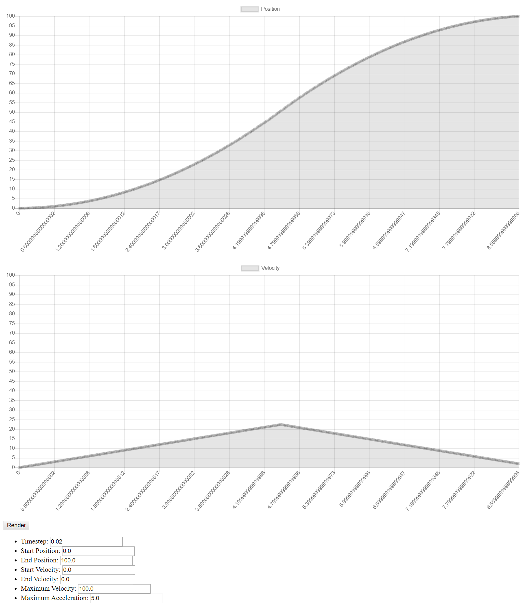

# 1-Dimensional Motion Profile Generator

This is a simple HTML & JS application that generates a motion profile given start and end positions and velocities as well as a maximum acceleration and velocity. Uses the [Chart.js](https://www.chartjs.org/) library to render motion profiles in real time.

